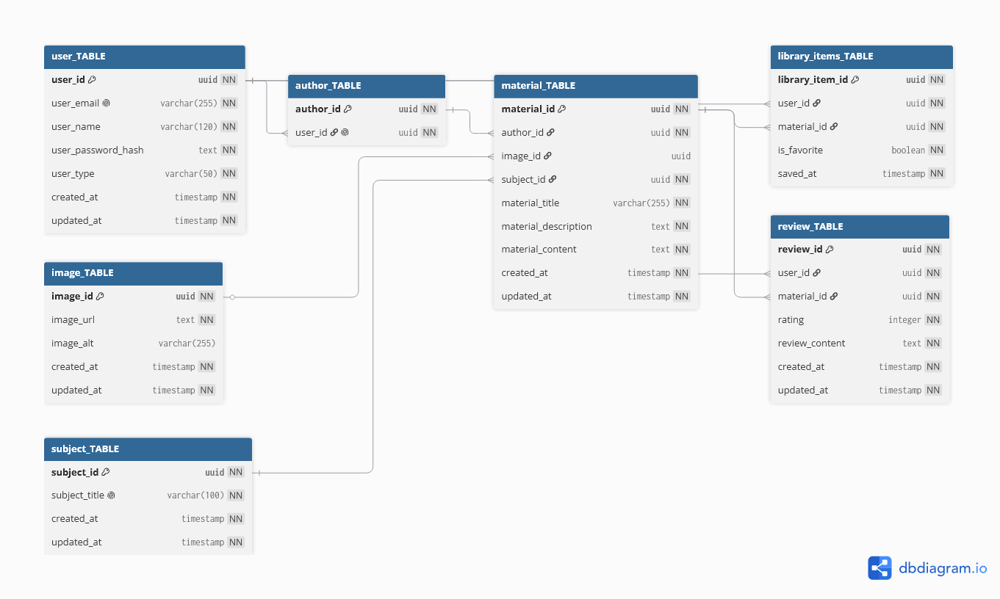

# InCludedEducation

Educational platform for teachers to explore, organize and access classroom materials. The project currently includes a functional React frontend and the initial relational database model for the future backend.

## Current Status

- Frontend application implemented with local mock data.
- Materials catalog, search, filters, multilingual interface and local library flow available.
- Database model documented and represented in DBML for backend planning.
- Backend and database integration not yet implemented.

## Technologies

- React
- Vite
- JavaScript
- CSS3
- React Router DOM
- DBML / dbdiagram.io
- PostgreSQL (planned database)

## Preview


## Demo


## Implemented Features

- Dynamic educational materials catalog
- Material details page
- Interface translations in English and Portuguese
- Search and subject filters
- Library persistence using browser local storage
- Reusable React components
- React Router navigation
- Service layer for access to material data

## Database Modeling

The initial database design covers users, authors, materials, subjects, images, library items and reviews.



Database documentation:

- [Dashboard](./docs/database/_Dashboard.md)
- [DBML schema](./docs/database/schema.dbml)
- [Documented model fields and constraints](./docs/database/model)

The database is currently a documented design. It has not yet been implemented in a backend or migration system.

## Project Structure

```txt
InCludedEducation/
|-- docs/
|   `-- database/
|       |-- _Dashboard.md
|       |-- db_model.png
|       |-- schema.dbml
|       `-- model/
|-- frontend/
|   |-- public/
|   |-- src/
|   |   |-- assets/
|   |   |-- components/
|   |   |   `-- MaterialsInfo/
|   |   |-- context/
|   |   |-- data/
|   |   |-- pages/
|   |   |-- services/
|   |   `-- utils/
|   |-- package.json
|   `-- vite.config.js
|-- LICENSE
`-- README.md
```

## Run The Frontend

Requirements:

- Node.js
- npm

From the repository root:

```bash
cd frontend
npm install
npm run dev
```

To run lint checks:

```bash
cd frontend
npm run lint
```

## Next Steps

- Define the backend architecture and API endpoints
- Implement PostgreSQL migrations from the documented model
- Add user authentication and authorization
- Replace local material data with API-backed data
- Replace local library persistence with user-associated database records
- Decide how grade levels and multilingual material content will be modeled

## Author

Guilherme Barreto Santos e Santos
