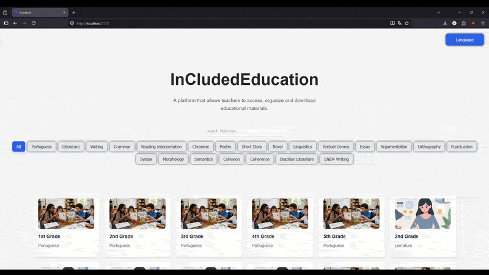

# InCludedEducation

A responsive educational platform that allows teachers to access, organize and explore educational materials in a modern and scalable interface.

---

## Technologies Used

- React
- Vite
- JavaScript
- CSS3
- React Router DOM
- Git
- GitHub

---

## Preview


---

## Demo



---

## Features

- Dynamic materials catalog
- Responsive material details page
- Multilingual interface (English and Portuguese)
- Search system
- Dynamic filtering system
- Reusable React components
- React Router navigation
- Animated purchase popup
- Modular CSS architecture
- Scalable catalog layout
- Responsive interface for desktop and mobile devices

---

## Project Structure

```txt
src/
│
├── assets/
│
├── components/
│   ├── MaterialsInfo/
│   ├── FilterBar.jsx
│   ├── SearchBar.jsx
│   ├── LanguageSelector.jsx
│   └── PurchaseButton.jsx
│
├── data/
│   ├── materials,js
│   ├── translations.js
├── pages/
│   ├── Home.jsx
│   └── MaterialDetails.jsx
│
├── utils/
│   └── filterMaterials.js
│
├── App.jsx
└── main.jsx
```

---

## Responsive Design

The platform is fully responsive and adapts to:
- Desktop
- Tablet
- Mobile devices

---

## Architecture

This project follows a modular component-based architecture using:
- Reusable React components
- Separated CSS files per component
- Utility-based filtering system
- Dynamic multilingual structure

---

## Future Improvements

- Backend integration
- User authentication
- Materials upload system
- User library system
- Favorites system
- Advanced search filters
- Pagination system
- Material rating system
- Cloud database integration

---

## Author

Guilherme Barreto Santos e Santos