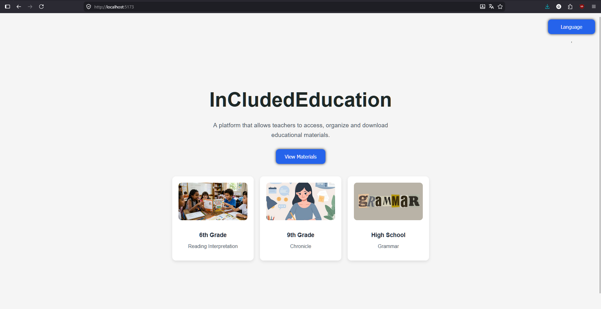
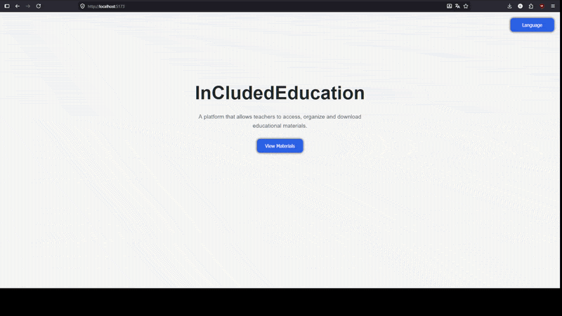

# InCludedEducation

A platform that allows teachers to access, organize and download educational materials.

## Technologies Used

- React
- Vite
- JavaScript
- CSS3
- React Router DOM
- Git
- GitHub

## Preview



## DEMO



## Features

- Dynamic materials cards
- Multilingual interface (English and Portuguese)
- Reusable React components
- Material details page
- React Router navigation
- Responsive cards layout
- Modularized language selector

## Project Structure

```txt
src/
    assets/
    components/
    data/
    pages/
```

## Future Improvements

- Materials download system
- Search and filters
- Backend integration
- User authentication
- Teacher uploads
- Database integration

## Author

Guilherme Barreto Santos e Santos
